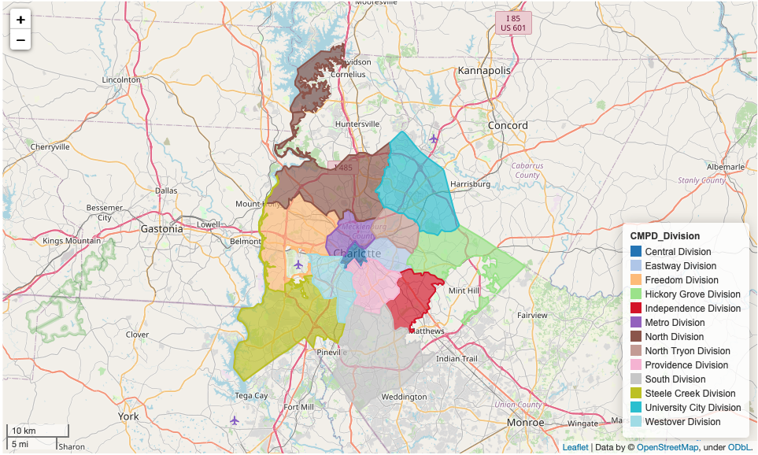

# Charlotte Mecklenburg Police Traffic Stop Project
This project is currently still in draft form. Github unfortunately does not allow the interactive map to load, so the best place to view the notebook is [here.](https://nbviewer.org/github/hausra5/CMPD-Project/blob/main/CMPD%20Project%20DRAFT.ipynb)

The Charlotte Mecklenburg Police Department (CMPD) conducts about 120,000 traffic stops per year. Under North Carolina state law, the CMPD is obligated to collect relevant information on each stop. This information includes demographics on both the driver and officer, the reason for the stop, the result of the stop, when the stop occured, and which division.

In this project, I analyze all the different reasons and results of a traffic stop to uncover patterns. I also implement predictive modeling to see if given someone is pulled over, can the model correctly predict the result of the stop.

## Table of contents
* [Demographics](#Demographics)
* [Geolocation](#Geolocation)
* [Machine Learning](#Machine-Learning)

## Demographics
The data provided has a lot of information regarding demographics. A fair amount of data cleaning was required but I was able to visualize multiple combinations of all the inputed features and was able to uncover some interesting patterns. Some of the visualizaions were grouped count bar plots that helped paint the picture further for reasons and results for stops. Below is a sample visualization based on Driver Race.

## Geolocation
Based on the Division for each Police Department, I was able to read in a couple different dataframes and using the geojson location information, I was able to create an interactive map that showed both population and traffic stop information for each location. Below are a couple samples of how the map can be used.

## Machine Learning
After using exploratory visualizations and simple statistical analysis on the features, I wanted to implement a few different models to see if the model could accurately predict a binary result of the traffic stop (citation or warning). I implemented multiple different KNN models, Logistic Regression with a Grid Search, and lastly a Random Forest model that was also tuned through a grid search. At the end of it, the Random Forest performed the best and offered up a 77% accuracy which was meaningful since the targets were balanced. Below is a sample example of the Classification Report.

